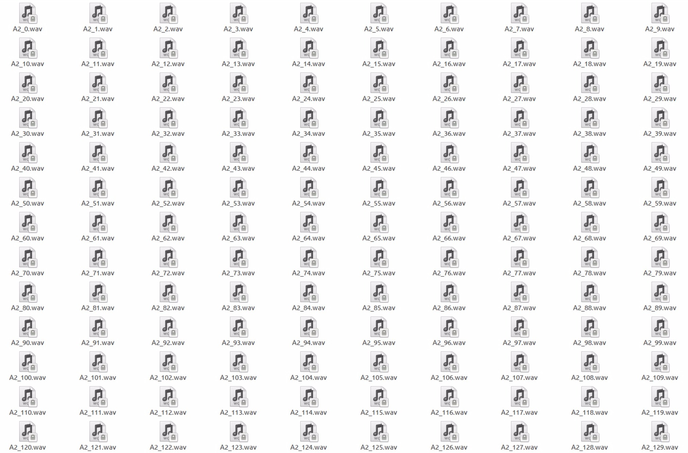

在机器学习中，文件读取是最常见的也较复杂的操作之一。通常，我们训练一个模型或者部署运行一个模型均需要对文件进行读写，例如获取训练数据集与保存训练模型。保存模型之前我们已经讲过了，这一节主要讲对训练数据集的读取操作。

Tensorflow读取训练数据主要有以下三种方法：

* feeding：即每次运行算法时，从Python环境中供给数据（不允许Tensor数据传入）。
* 常量：在图中设置一些常量进行保存数据。这仅仅适合数据量较小的情况。
* 文件读取。直接从文件中读取。

机器学习中训练模型使用的数据集通常比较大，有些数据往往存储在多个文件中，而另一些数据则根据其功能写入不同的文件中，这时候从文件中读取比较方便。例如MNIST中包含4个文件。如下：

~~~wiki
train-images-idx3-ubyte.gz:  training set images (9912422 bytes) 
train-labels-idx1-ubyte.gz:  training set labels (28881 bytes) 
t10k-images-idx3-ubyte.gz:   test set images (1648877 bytes) 
t10k-labels-idx1-ubyte.gz:   test set labels (4542 bytes)
~~~

第一个文件是MNIST的训练集中的图片，第二个文件是训练集中的标记，第三个文件是测试集中的图片，第四个文件是测试集中的标记。

这样的好处是数据集的数据结构清晰。但有时候这样也会加大我们获取数据的难度，例如我们必须同时读取不同的文件来获得一条完整的数据样本，例如我们需要设置复杂的多线程加快数据读取。而Tensorflow提供了读取数据的便捷方法。


## 1. 文件读取数据的流程

从文件中读取数据是最常见的数据读取的方法。这里的“文件”是指文本文件、二进制文件等。从文件中读取数据可以配合之前所学的队列与线程的知识，高效的完成工作。

这里我们首先介绍从文件中读取数据的方法，之后再去结合线程与队列进行使用。


### 1.1 文件读取

文件读取可以分为两种情况，第一种是直接读取文件，第二种是从文件名队列中读取数据。对于文件较多的数据集，我们通常采用第二种方法。

#### 1.1.1 直接读取文件

使用`tf.read_file`对文件进行读取，返回一个`string`类型的Tensor。

~~~python
tf.read_file(filename, name=None)
~~~

一个数据结构如下的csv文件，其读取的结果是：`b'1,11\n2,22\n3,33\n'`

~~~tex
1,11
2,22
3,33
~~~

可以看到，这种方法仅仅适合读取一个文件就是一个样本（或特征）的数据，例如图片。由于解码不方便，其不适合读取文本文件或其它文件。

#### 1.1.2 从文件名队列中读取

为什么我们需要从文件名队列中读取呢？因为随着样本数据规模的增大，文件的数量急剧增多，如何管理文件就成为了一个问题。例如，我们拥有100个文件，我们希望读取乱序读取文件生成5代（epoch）样本，直接管理文件就很麻烦。使用队列，就可以解决这个问题。

从文件名队列中读取文件有2个步骤。

##### 步骤一：生成文件名队列

Tensorflow为我们提供了文件名队列`tf.train.string_input_producer`用于管理被读取的文件。

~~~python
# 返回一个队列，同时将一个QueueRunner加入图的`QUEUE_RUNNER`集合中
tf.train.string_input_producer(
    string_tensor,  # 1维的string类型的文件名张量 可以是文件路径
    num_epochs=None,  # 队列的代，设置了之后，超出队列会出现OutOfRange错误，且需要使用local_variables_initializer()初始化
    shuffle=True,  # True代表每一个代中的文件名是打乱的
    seed=None,  # 随机种子
    capacity=32,  # 队列容量
    shared_name=None,
    name=None,
    cancel_op=None)
~~~

**注意：`local_variables_initializer()`需要写在用到local_variable的地方的后面。这与`global_variables_initializer()`用法不太一样。**

例如，生成两个csv文件名队列：

~~~python
filename_queue = tf.train.string_input_producer(['1.csv', '2.csv'])
~~~

或者我们可以使用列表推导来生成文件名队列，例如：

~~~python
filename_queue = tf.train.string_input_producer(['%d.csv' % i for i in range(1, 3)])
~~~

对于简单的、文件较少的数据集，使用上述方法生成文件名队列很合适。但面对大型的数据集，这样操作就不够灵活，例如中文语音语料库thchs30训练数据集的音频文件有一个目录A2中的文件如下：



这个数据集目录中包含类了似于A2这样的目录就有几十个，每个目录中都有200个左右的文件。这些文件的名称都有一定的规律，例如A2目录下的文件的文件名开头都是'A2'，结尾都是'.wav'中间是不连续的1-n的自然数。我们无法使用列表推导`['A2_%d.wav' % i for i in range(n)]`（因为不连续）。

Tensorflow提供了获取文件名的模式匹配的方法`tf.train.match_filenames_once`。可以灵活的使用此方法获取我们所要的文件名，过滤掉不需要的文件的文件名。用法如下：

```python
tf.train.match_filenames_once(
    pattern,  # 文件名匹配模式（glob，可以看做是简化版的正则表达式）或者一个文件名Tensor
    name=None
)
```

glob是Linux内建的用于文件路径查找的函数，glob通配符类型有：

- `*` ：任意长度的任意字符
- `?` ：任意单个字符
- `[]` ：匹配指定范围内的单个字符
- `[0-9]` ：单个数字
- `[a-z]` ：不区分大小写的a-z
- `[A-Z]` ：大写字符
- `[^]` ：匹配指定范围外的单个字符

使用`tf.train.match_filenames_once`获取文件名队列的代码如下：

```python
filenames = tf.train.match_filenames_once('A2_*.wav')  # 这里也可以直接写 '*'
```

然后可以根据所有文件名`filenames`生成文件名队列：

~~~python
filename_queue = tf.train.string_input_producer(filenames)
~~~

##### 步骤二：根据文件名队列读取相应文件

文件名队列出队得到的是文件名（也可以是文件路径），读取数据正是从这些文件名中找到文件并进行数据读取的。但需要注意的是，Tensorflow实现了配合“文件名出队”操作的数据读取op，所以我们并不需要写出队操作与具体的文件读取方法。同时读取数据的方法也有很多种，这里我们以读取csv文件为例，下文中，我们给出了更多种文件的读取方法。

读取csv文件，需要使用**文本文件读取器**`tf.TextLineReader`，与csv解码器一起工作。

[CSV文件](https://tools.ietf.org/html/rfc4180)就是以逗号进行分割值，以\\n为换行符的文本文件，文件的后缀名为.csv。

`tf.TextLineReader`用法如下：

```python
# 创建一个读取器对象
# 输出由换行符分割的文件读取器 可以用来读取csv、text等文本文件
tf.TextLineReader(skip_header_lines=None, name=None)

# 从文件名队列中读取数据 并返回下一个`record`(key, value)
# 相当于出队操作
tf.TextLineReader.read(filename_queue, name=None)
```

读取数据之后，我们还需要对数据进行解码，将其转变为张量，CSV文件的解码方法如下：

```python
# 将csv文件解码成为Tensor
tf.decode_csv(
  	records,
  	record_defaults,  # 默认值，当 records 中有缺失值时，使用默认值填充
  	field_delim=',',  # 分隔符
  	use_quote_delim=True,  # 当为True时，会去掉元素的引号，为False时，会保留元素的引号
  	name=None)
```


继续步骤一中未完成的例子，读取数据的操作如下：

~~~python
reader = tf.TextLineReader()
key, value = reader.read(filename_queue)  # filename_queue是第一步生成的文件名队列

decoded = tf.decode_csv(value, record_defaults)  # record_defaults是必填项，此处省略了。
~~~

这里得到的key是文件名与行索引，value是key对应的张量值。key与value均为`tf.string`类型。

到这里，我们已经通过文件名队列获取到了数据，完成了我们的目标。


### 1.2 利用队列存取数据

虽然我们已经读取并解码了文件，但直接使用解码后的张量依然有很多的问题。例如我们希望使用“批量样本”，而其产生的是单个样本；例如当生成样本的速度与消费样本的速度不匹配时，可能造成阻塞。这些问题，我们可以使用队列来解决。

上一章，我们使用了队列对张量数据进行存储与读取。使用队列最大的优点就是可以充分发挥生产者-消费者的模式。而上文中，我们已经把文件读取并转换为了张量，那么我们就可以使用队列来管理读取的数据。

我们仍以读取csv文件为例进行演示：

~~~python
g = tf.Graph()
with g.as_default():
    # 生成“文件名队列”
    filenames = tf.train.match_filenames_once('./csv/*.csv')
    filename_queue = tf.train.string_input_producer(filenames)

    # 读取数据     
    reader = tf.TextLineReader()
    key, value = reader.read(filename_queue)

    # 解码csv文件  record_default的值根据实际情况写
    decoded = tf.decode_csv(value, record_defaults=[[0], [0]])

    # 创建“样本队列”  这里容量与类型需要根据实际情况填写 
    example_queue = tf.FIFOQueue(5, tf.int32)
    # 入队操作    
    enqueue_example = example_queue.enqueue([decoded])
    # 出队操作   根据需要也可以dequeue_many 
    dequeue_example = example_queue.dequeue()

    # 创建队列管理器  根据需要制定线程数量num_threads，这里为1
    qr = tf.train.QueueRunner(example_queue, [enqueue_example] * 1)
    # 将qr加入图的QueueRunner集合中
    tf.train.add_queue_runner(qr)

with tf.Session(graph=g) as sess:
    # 创建线程协调器
    sess.run(tf.local_variables_initializer())
    coord = tf.train.Coordinator()
    threads = tf.train.start_queue_runners(sess=sess, coord=coord)
    # 出队数据
    for i in range(15):
        print(sess.run(dequeue_example))

    # 停止
    coord.request_stop()
    coord.join(threads)
~~~

cuo

上面的代码就是完整的从文件中读取数据，并存在队列中的例子。这个例子中使用了2个队列，分别是：

* 文件名队列
* 数据读取与生成队列

通过使用队列，使得数据的读取与使用变得简便与条理。但可以看到上面的代码仍然较繁琐，Tensorflow提供了更加简便的API来简化操作，和完善功能。


### 1.3 简便的批量样本生成

上面的读取文件的例子中，使用了2个队列，其中“文件名队列”与“样本数据读取队列”已经被Tensorflow抽象成了简便的API，即我们不需要显式的创建队列和创建对应的队列管理器。其实第三个队列“样本队列”，Tensorflow也给出了更加简便的API，这些API的用法如下：

注意：以下几个API均可以完成样本生成，但功能略微不同。

* `tf.train.batch`

  API的详情如下：

  ~~~python
  # 返回一个dequeue的OP，这个OP生成batch_size大小的tensors
  tf.train.batch(
      tensors,  # 用于入队的张量
    	batch_size,  # 出队的大小
    	num_threads=1,  # 用于入队的线程数量
    	capacity=32,  # 队列容量
    	enqueue_many=False,  # 入队的样本是否为多个
    	shapes=None,  # 每个样本的shapes 默认从tensors中推断
    	dynamic_pad=False,  # 填充一个批次中的样本，使之shape全部相同
    	allow_smaller_final_batch=False,  # 是否允许最后一个批次的样本数量比正常的少
    	shared_name=None,
    	name=None)
  ~~~

  在读取数据并解码之后，可以将张量送入此方法。

  读取文件时，只需要将上面的例子中的批量样本生成代码替换为此即可，例如：

  ~~~python
  ...
  decoded = tf.decode_csv(...)

  dequeue_example = tf.train.batch(decoded, batch_size=5)
  ~~~

  比之前少些了4行代码。更加简洁明了。

  ​

* `tf.train.batch_join`

  API的详情如下：

  ~~~python
  # 返回一个dequeue的OP，这个OP生成batch_size大小的tensors
  tf.train.batch_join(
      tensors_list,  # 入队
      batch_size,
      capacity=32,
      enqueue_many=False,
      shapes=None,
      dynamic_pad=False,
      allow_smaller_final_batch=False,
      shared_name=None,
      name=None)
  ~~~

  此方法与上述方法类似，但是创建多线程的方法不同。这里是根据tensors_list的长度来决定线程的数量的。用法如下：

  ~~~python
  ...
  decoded_list = [tf.decode_csv(...) for _ in range(2)]

  dequeue_example = tf.train.batch_join(decoded_list, batch_size=5)
  ~~~

  这里创建了2个解码器，在数据读取时，会分别给这两个解码op创建各自的线程。本质上与上面的方法是一样。

* `tf.train.shuffle_batch`

  与`tf.train.batch`相比，此方法可以打乱输入样本。API详情如下：

  ~~~python
  tf.train.shuffle_batch(
      tensors, 
      batch_size, 
      capacity, 
      min_after_dequeue,
      num_threads=1,
      seed=None,  # 随机数种子
      enqueue_many=False, 
      shapes=None,
      allow_smaller_final_batch=False, 
      shared_name=None, 
      name=None)
  ~~~

  用法与`tf.train.batch`类似。

* `tf.train.shuffle_batch_join`

  与`tf.train.batch_join`相比，此方法可以打乱输入样本。API详情如下：

  ~~~python
  tf.train.shuffle_batch(
      tensors, 
      batch_size, 
      capacity, 
      min_after_dequeue,
      num_threads=1, 
      seed=None, 
      enqueue_many=False, 
      shapes=None,
      allow_smaller_final_batch=False, 
      shared_name=None, 
      name=None)
  ~~~

  用法与`tf.train.batch_join`类似。


### 1.4 完整读取数据一般步骤

从文件中读取数据的一般步骤如下：

1. 生成文件名队列。
2. 读取文件，生成样本队列。
3. 从样本队列中生成批量样本。


例子：

~~~python
# 第一步 生成文件名队列
filename_queue = tf.train.string_input_producer(['1.csv', '2.csv'])

# 第二步 根据文件名读取数据
reader = tf.TextLineReader(filename_queue)
record = reader.read(filename_queue)
# 解码数据成为Tensor
csv_tensor = tf.decode_csv(record, default_record=[...])

# 第三步 根据Tensors生产批量样本
batch_example = tf.train.batch(csv_tensor, batch_size)
~~~


## 2. 高效读取数据

上面的例子，我们直接从原始文件中读取数据。当文件数量较多，且解码不够迅速时，上面的方法就显示出了一些缺陷。在Tensorflow中，我们可以使用TFRecord对数据进行存取。TFRecord是一种二进制文件。可以更快速的操作文件。

通常我们得到的数据集并不是TFRecord格式，例如MNIST数据集也是一个二进制文件，每一个字节都代表一个像素值（除去开始的几个字节外）或标记，这与TFRecord文件的数据表示方法（TFRecord的二进制数据中还包含了校验值等数据）并不一样。所以，通常我们需要将数据转化为TFRecord文件。这里需要注意并不是每一个数据集均需要转化为TFRecord文件，建议将文件数量较多，直接读取效率低下的数据集转化为TFRecord文件格式。


### 2.1 写入TFRecord文件

TFRecord文件的存取，本质上是对生成的包含样本数据的ProtoBuf数据的存取，TFRecord文件只适合用来存储数据样本。一个TFRecord文件存储了一个或多个example对象，example.proto文件描述了一个样本数据遵循的格式。每个样本example包含了多个特征feature，feature.proto文件描述了特征数据遵循的格式。

在了解如何写入TFRecord文件前，我们首先了解一下其对应的消息定义文件。通过这个文件，我们可以知道消息的格式。

**feature.proto**的内容如下（删除了大部分注释内容）：

~~~protobuf
syntax = "proto3";
option cc_enable_arenas = true;
option java_outer_classname = "FeatureProtos";
option java_multiple_files = true;
option java_package = "org.tensorflow.example";

package tensorflow;

// Containers to hold repeated fundamental values.
message BytesList {
  repeated bytes value = 1;
}
message FloatList {
  repeated float value = 1 [packed = true];
}
message Int64List {
  repeated int64 value = 1 [packed = true];
}

// Containers for non-sequential data.
message Feature {
  // Each feature can be exactly one kind.
  oneof kind {
    BytesList bytes_list = 1;
    FloatList float_list = 2;
    Int64List int64_list = 3;
  }
};

message Features {
  // Map from feature name to feature.
  map<string, Feature> feature = 1;
};

message FeatureList {
  repeated Feature feature = 1;
};

message FeatureLists {
  // Map from feature name to feature list.
  map<string, FeatureList> feature_list = 1;
};
~~~

可以看到一个特征`Feature`可以是3中数据类型（`BytesList`，`FloatList`，`Int64List`）之一。多个特征`Feature`组成一个组合特征`Features`，多个特征列表组成特征列表组`FeatureLists`。

**example.proto**的内容如下（删除了大部分注释内容）：

```protobuf
syntax = "proto3";

import "tensorflow/core/example/feature.proto";
option cc_enable_arenas = true;
option java_outer_classname = "ExampleProtos";
option java_multiple_files = true;
option java_package = "org.tensorflow.example";

package tensorflow;

message Example {
  Features features = 1;
};

message SequenceExample {
  Features context = 1;
  FeatureLists feature_lists = 2;
};
```

可以看到一个样本`Example`包含一个特征组合。序列样本`SequenceExample`包含一个类型是特征组合的上下文`context`与一个特征列表组`feature_lists`。

可以看到：**TFRecord存储的样本数据是以样本为单位的。**

了解了TFRecord读写样本的数据结构之后，我们就可以使用相关API进行操作。

#### 写入数据

Tensorflow已经为我们封装好了操作protobuf的方法以及文件写入的方法。写入数据的第一步是打开文件并创建writer对象，Tensorflow使用`tf.python_io.TFRecordWriter`来完成，具体如下：

~~~python
# 传入一个路径，返回一个writer上下文管理器
tf.python_io.TFRecordWriter(path, options=None)
~~~

TFRecordWriter拥有`write`，`flush`，`close`方法，分别用于写入数据到缓冲区，将缓冲区数据写入文件并清空缓冲区，关闭文件流。

开启文件之后，需要创建样本对象并将example数据写入。根据上面的proto中定义的数据结构，我们知道一个样本对象包含多个特征。所以我们首先需要创建特征对象，然后再创建样本对象。如下为序列化一个样本的例子：

~~~python
with tf.python_io.TFRecordWriter('./test.tfrecord') as writer:
    f1 = tf.train.Feature(int64_list=tf.train.Int64List(value=[i]))
    f2 = tf.train.Feature(float_list=tf.train.FloatList(value=[1. , 2.]))
    b = np.ones([i]).tobytes()  # 此处默认为float64类型
    f3 = tf.train.Feature(bytes_list=tf.train.BytesList(value=[b]))

    features = tf.train.Features(feature={'f1': f1, 'f2': f2, 'f3': f3})
    example = tf.train.Example(features=features)

    writer.write(example.SerializeToString())
~~~

序列化多个样本只需要重复上述的写入过程即可。如下：

~~~python
with tf.python_io.TFRecordWriter('./test.tfrecord') as writer:
    # 多个样本多次写入
    for i in range(1, 6):
        f1 = tf.train.Feature(int64_list=tf.train.Int64List(value=[i]))
        f2 = tf.train.Feature(float_list=tf.train.FloatList(value=[1. , 2.]))
        b = np.ones([i]).tobytes()
        f3 = tf.train.Feature(bytes_list=tf.train.BytesList(value=[b]))
        
        features = tf.train.Features(feature={'f1': f1, 'f2': f2, 'f3': f3})
        example = tf.train.Example(features=features)
        
        writer.write(example.SerializeToString())
~~~

**注意事项：**

* `tf.train.Int64List`、`tf.train.FloatList`、`tf.train.BytesList`均要求输入的是python中的list类型的数据，而且list中的元素分别只能是int、float、bytes这三种类型。
* 由于生成protobuf数据对象的类中，只接受关键字参数，所以参数必须写出参数名。
* protobuf数据对象类需要遵循proto文件中定义的数据结构来使用。


TFRecord文件的数据写入是在Python环境中完成的，不需要启动会话。写入数据的过程可以看做是原结构数据转换为python数据结构，再转换为proto数据结构的过程。完整的数据写入过程如下：

1. 读取文件中的数据。
2. 组织读取到的数据，使其成为以“样本”为单位的数据结构。
3. 将“样本”数据转化为Python中的数据结构格式（int64\_list，float\_list，bytes\_list三种之一）。
4. 将转化后的数据按照proto文件定义的格式写出“Example”对象。
5. 将“Example”对象中存储的数据序列化成为二进制的数据。
6. 将二进制数据存储在TFRecord文件中。


### 2.2 读取TFRecord文件

读取TFRecord文件类似于读取csv文件。只不过使用的是`tf.TFRecordReader`进行读取。除此以外，还需要对读取到的数据进行解码。`tf.TFRecordReader`用法如下：

~~~python
reader = tf.TFRecordReader(name=None, options=None)
key, value = reader.read(queue, name=None)
~~~

此处读取到的value是序列化之后的proto样本数据，我们还需要对数据进行解析，这里可以使用方法`tf.parse_single_example`。解析同样需要说明解析的数据格式，这里可以使用`tf.FixedLenFeature`与`tf.VarLenFeature`进行描述。

解析单个样本的方法如下：

~~~python
# 解析单个样本
tf.parse_single_example(serialized, features, name=None, example_names=None)
~~~

解析设置数据格式的方法如下

~~~python
# 定长样本
tf.FixedLenFeature(shape, dtype, default_value=None)
# 不定长样本
tf.VarLenFeature(dtype)
~~~

完整例子如下（解析的是上文中写入TFRecord文件的例子中生成的文件）：

~~~python
reader = tf.TFRecordReader()
key, value = reader.read(filename_queue)

example = tf.parse_single_example(value, features={
    'f1': tf.FixedLenFeature([], tf.int64),
    'f2': tf.FixedLenFeature([2], tf.float32),
    'f3': tf.FixedLenFeature([], tf.string)})

feature_1 = example['f1']
feature_2 = example['f2']
feature_3 = tf.decode_raw(example['f3'], out_type=tf.float64)
~~~

这里还用到了`tf.decode_raw`用来解析bytes数据，其输出type应该等于输入时的type，否则解析出的数据会有问题。

```python
tf.decode_raw(
    bytes,  # string类型的tensor
    out_type,  # 输出类型，可以是`tf.half, tf.float32, tf.float64, tf.int32, tf.uint8, tf.int16, tf.int8, tf.int64`
    little_endian=True,  # 字节顺序是否为小端序
    name=None)
```


无论使用哪一数据读取的方法，其过程都是一样的。过程如下：

1. 打开文件，读取数据流。
2. 将数据流解码成为指定格式。在TFRecord中，需要首先从proto数据解码成包含Example字典数据，再把其中bytes类型的数据解析成对应的张量。其它的比如csv则可以直接解析成张量。
3. 关闭文件。


## 3. 数据读取的更多方法

上文介绍了数据读取的流程以及完整读取数据的方法，但我们还可以更灵活的使用这些方法。同时，Tensorflow也提供了更多的方法来满足我们多种多样的需求。


### 3.1 多种文件读取器

上文中，我们介绍了从CSV文件中读取数据与TFRecord文件的读写数据的方式。事实中，Tensorflow除了可以读取CSV文件以及TFRecord文件以外，还可以读取二进制文件（非TFRecord文件）等多种文件。这里我们列出了Tensorflow支持的所有文件读取器。

* **`tf.ReaderBase`**

  所有文件读取器的基类。常用方法如下：

  * `tf.ReaderBase.read(queue, name=None)`：返回下一个记录 (key, value)。key表示其所读取的文件名以及行数等信息。value表示读取到的值，类型为bytes。
  * `tf.ReaderBase.read_up_to(queue, num_records, name=None)`：返回下num_records个记录(key, value)。其有可能返回少于num_records的记录。
  * `tf.ReaderBase.reset(name=None)`：将读取器恢复到初始状态。

* **`tf.TextLineReader`**

  文本文件读取器。可以用于读取csv、txt等文件。

* **`tf.WholeFileReader`**

  整个文件读取器。不同于TextLineReader读取到的数据是一行一行（以\\n换行符分割）的，WholeFileReader可以用于读取整个文件。例如读取一张图片时，我们可以使用这个方法进行读取。**仅读取一个文件时，可以使用`tf.read_file`**方法进行代替。

* **`tf.IdentityReader`**

  用于读取文件名。

* **`tf.TFRecordReader`**

  从TFRecord文件中读取数据。

* **`tf.FixedLengthRecordReader`**

  从文件中读取固定字节长度的数据。可以使用`tf.decode_raw`解码数据。

* **`tf.LMDBReader`**

  从LMDB数据库文件中读取。


