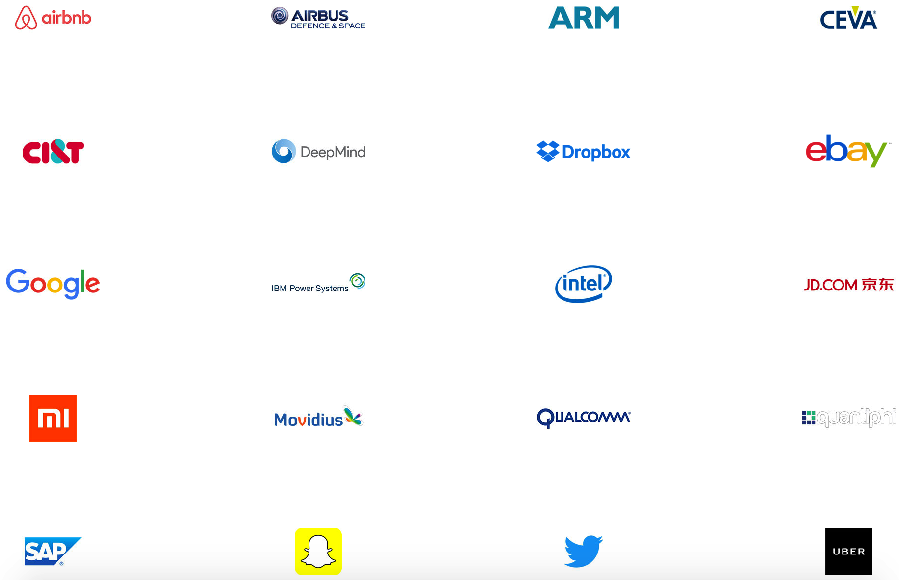

# Tensorflow概述

### 什么是Tensorflow

Tensorflow是由Google Brain Team开发的使用数据流图进行数值计算的开源机器学习库。Tensorflow的一大亮点是支持异构设备分布式计算(heterogeneous distributed computing)。这里的异构设备是指使用CPU、GPU等计算设备进行有效地协同合作。

*Google Brain Team与DeepMind是独立运行相互合作的关系。*

Tensorflow拥有众多的用户，除了Alphabet内部使用外，ARM、Uber、Twitter、京东、小米等众多企业均使用Tensorflow作为机器学习的工具。

常见机器学习库包括Tensorflow、MXNet、Torch、Theano、Caffe、CNTK、scikit-learn等。

|                  库                  | 维护人员或机构                         |             支持语言              |              支持操作系统              |
| :---------------------------------: | :------------------------------ | :---------------------------: | :------------------------------: |
|             Tensorflow              | google                          |         Python、C++、Go         | Linux、mac os、Android、iOS、Windows |
|                MXNet                | 分布式机器学习社区(DMLC)                 | Python、Scala、R、Julia、C++、Perl | Linux、mac os、Android、iOS、Windows |
|                Torch                | Ronan Collobert等人               |         Lua、LuaJIT、C          | Linux、mac os、Android、iOS、Windows |
|               Theano                | 蒙特利尔大学( Université de Montréal) |            Python             |       Linux、mac os、Winodws       |
| Computational Network Toolkit(CNTK) | 微软研究院                           |    Python、C++、BrainScript     |          Linux、Windows           |
|                Caffe                | 加州大学伯克利分校视觉与学习中心                |       Python、C++、MATLAB       |       Linux、mac os、Windows       |
|            PaddlePaddle             | 百度                              |          Python、C++           |           Linux、mac os           |

各个框架对比https://github.com/zer0n/deepframeworks

### Tensor

Tensor是张量的意思，原本在物理学中用来描述大于等于2维的量进行量纲分析的工具。我们早已熟知如何处理0维的量（纯量）、1维的量（向量）、2维的量（矩阵）。对于高维的数据，我们也需要一个工具来表述，这个工具正是张量。

张量类似于编程语言中的多维数组（或列表）。广义的张量包括了常量、向量、矩阵以及高维数据。在处理机器学习问题时，经常会遇到大规模样本与大规模计算的情况，这时候往往需要用到张量来进行计算。Tensorflow中张量是最重要与基础的概念。

### 编程模式

编程模式通常分为**命令式编程（imperative style programs）**和**符号式编程（symbolic style programs）**。命令式编程，直接执行逻辑语句完成相应任务，容易理解和调试；符号式编程涉及较多的嵌入和优化，很多任务中的逻辑需要使用图进行表示，并在其他语言环境中执行完成，不容易理解和调试，但运行速度有同比提升。

命令式编程较为常见，例如直接使用C++、Python进行编程。例如下面的代码：

~~~python
import numpy as np
a = np.ones([10,])
b = np.ones([10,]) * 5
c = a + b
~~~

当程序执行到最后一句时，a、b、c三个变量有了值。程序执行的是真正的计算。

符号式编程不太一样，仍然是完成上述功能，使用符号式编程的写法如下（伪代码）：

~~~python
a = Ones_Variables('A', shape=[10,])
b = Mul(Ones_Variables('B', shape=[10,]), 5)
c = Add(a, b)

# 计算
Run(c)
~~~

上述代码执行到c=Add(a, b)时，并不会真正的执行加法运算，同样的a、b也并没有对应的数值，a、b、c均是一个符号，符号定义了执行运算的结构，我们称之为**计算图**，计算图没有执行真正的运算。当执行Run(c)时，计算图开始真正的执行计算，计算的环境通常不是当前的语音环境，而是C++等效率更高的语言环境。

机器学习库中，Tensorflow、theano使用了符号式编程；Torch使用了命令式编程；caffe、mxnet采用了两种编程模式混合的方式。

### 数据流图

当我们使用计算图来表示计算过程时，事实上可以看做是一个推断过程。在推断时，我们输入一些数据，并使用符号来表示各种计算过程，最终得到一个或多个推断结果。所以使用计算图可以在一定程度上对计算结果进行预测。

计算图在推断的过程中也是数据流转的过程，所以我们也可以称之为**数据流图**。举个例子，假如我们计算$(a+b)*(b+1)$的值，那么我们画出其数据流图，如下：

输入a与b，通过不同通路进行计算并传入下一个节点。这一过程就是数据流动的过程。有了数据流图，我们还可以进行更多的操作，例如自动求微分等，在此不做赘述。

### Tensorflow高层库

Tensorflow本质上是数值计算库，在数值处理与计算方面比较方便、灵活。虽然Tensorflow为机器学习尤其是深度学习提供了很多便捷的API，但在构建算法模型时，仍然较为复杂。为此Tensorflow官方以及众多第三方机构与个人开发了很多的使用简便的高层库，这些库与Tensorflow完全兼容，但可以极大简化模型构建、训练、部署等操作。其中较为常用工具包与高层库为：

1. TF Learn(tf.contrib.learn)：类似于scikit-learn的使用极少代码量即可构建机器学习算法的工具包。
2. TF Slim(tf.contrib.slim)：一个轻量级的用于定义、训练、评估深度学习算法的Tensorflow工具包。
3. 高级API：Keras，TFLearn，Pretty Tensor

### Tensorflow的发展

2015年11月9日，Tensorflow的0.5的版本发布并开源。起初Tensorflow的运行效率低下，不支持分布式、异构设备，并不被看好。2016年4月，经过不到半年的时间发布了0.8版本，开始支持分布式、多GPU运算，2016年6月，0.9的版本改进了对移动设备的支持，到此时，Tensorflow已经成为了为数不多的支持分布式、异构设备的开源机器学习库，并极大的改善了运算效率问题，成为运算效率最高的机器学习算法库之一。2017年2月，Tensorflow的1.0正式版发布，增加了专用的编译器XLA、调试工具Debugger和tf.transform用来做数据预处理，并开创性的设计了Tensorflow Fold用于弥补符号编程在数据预处理时的缺陷，成为了行业领先的机器学习库。到现在Tensorflow已经成为了众多企业、机构中最常用的机器学习库。

## Tensorflow能干什么？

1. 设计机器算法。
2. 训练机器学习算法。
3. 部署算法到多种设备上。
4. 很适合做深度学习。

# 机器学习相关赛事

伴随着机器学习热度的提升，国内外也相继出现了各种挑战赛。这些挑战赛激励着全世界的从业人员不断的优化自己的算法和提高算法结果的准确率，引领了机器学习的发展方向。

### ILSVRC

ILSVRC（ImageNet Large Scale Visual Recognition Challenge）即大规模视觉识别挑战赛。是用来大规模评估对象检测和图像识别的算法的挑战赛。从2010年开始，每年举办一次比赛。[ImageNet](http://www.image-net.org/)是目前世界上最大的公开的图像识别库，拥有超过1500万张有标记的高分辨率图像数据集，这些图像分属于大概22000个类别。ILSVRC使用ImageNet的一个子集，分为1000种类别，每种类别中大约有1000张图像，总共大概有120万张训练图像，5万张验证图像和15万张测试图像。

在ImageNet上，习惯性地报告两个错误率：Top-1和Top-5。Top-1错误率是指预测输出的概率最高的类别，是否和人工标记的类别一致，如果不一致，此时的概率。Top-5错误率是指预测输出的概率最高的前五个类别当中，有没有和人工标记的类别一致的，当五个都不一致时的概率。

2017年的比赛是最后一届ILSVRC。值得注意的是，中国的企业与机构在2016年与2017年的比赛当中，包揽了众多项目的比赛冠军。

### Kaggle

ILSVRC是大规模的比赛，参赛队伍均是大型企业与机构。而[Kaggle](https://www.kaggle.com/)这个平台是面向个人开发者或小团队的。Kaggle成立于2010年，是一个数据发掘、数据分析和预测竞赛的在线平台。与Kaggle合作之后，一家公司可以提供一些数据，进而提出一个问题，Kaggle网站上的计算机科学家将领取任务，提供潜在的解决方案。最终胜出的解决方案可以获得3万-25万美元的奖励。Kaggle是一个众包理念的平台，利用全世界的人才来解决一个大问题。

Kaggle非常适合学生参加，因为一般的在校学生可能拿不到很多数据。此外，kaggle不仅对参赛者有算法能力上的要求，而且能锻炼参赛者对数据的“嗅觉”，使参赛者从数据本身问题出发寻求解决方案。

### 天池大数据竞赛

“[天池](https://tianchi.aliyun.com/)”是阿里搭建的一个大数据竞赛平台。这个平台一般会有一些穿衣搭配挑战，新浪微博互动预测等。如果在一些项目上取得不错的成绩，还有丰富的奖金以及进入阿里巴巴工作的机会。

